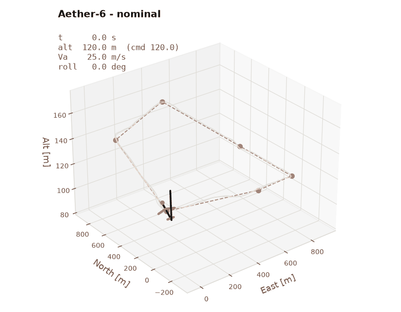
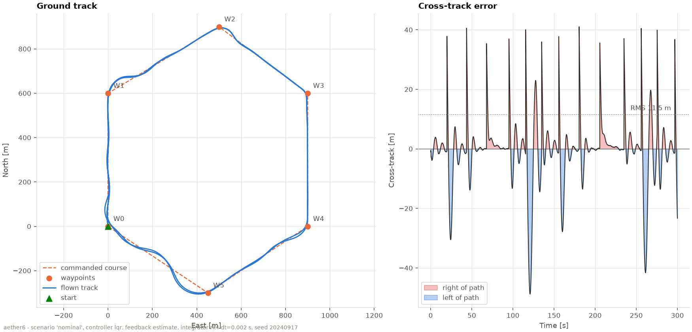
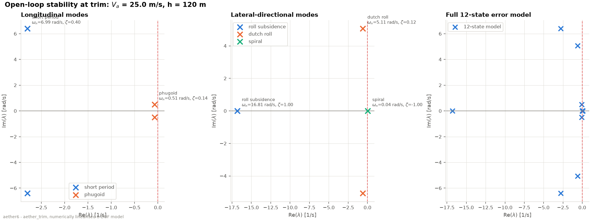
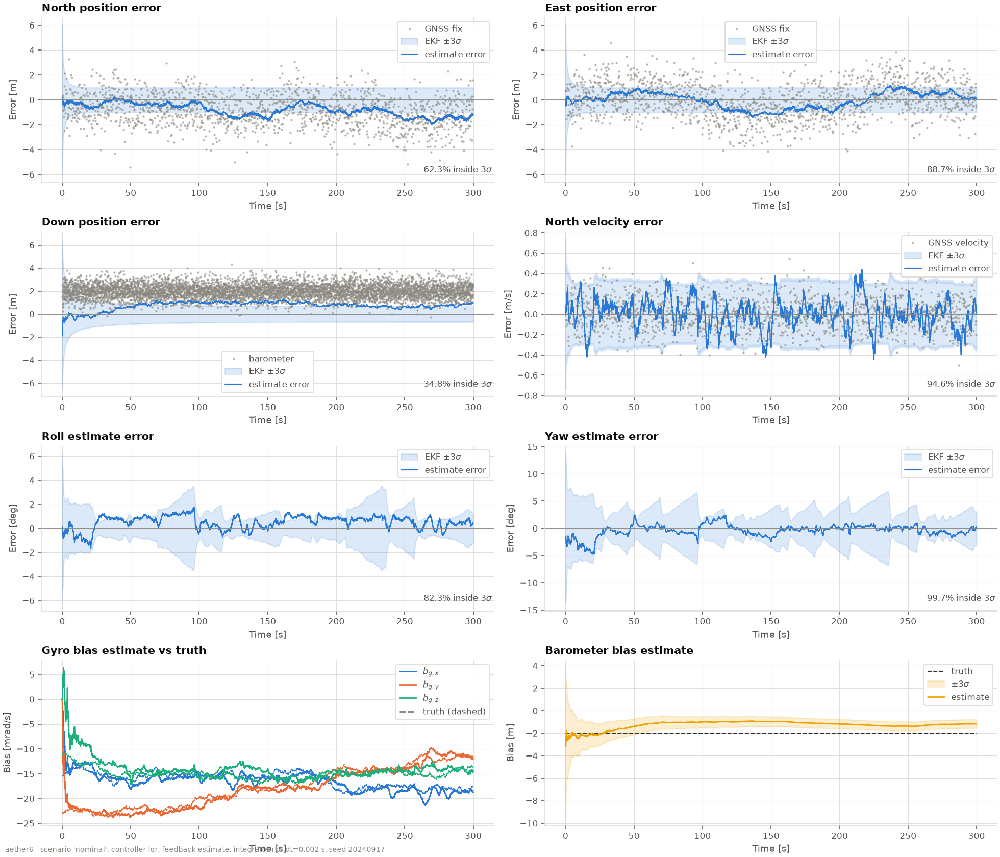
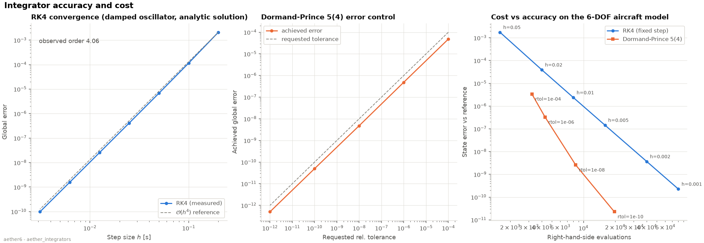
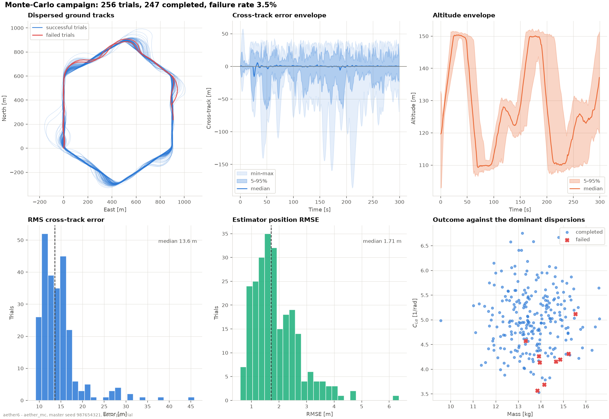

# Aether-6

**A six-degree-of-freedom fixed-wing flight dynamics, guidance, navigation and control
simulator.** Nonlinear rigid-body flight physics, trim and linearisation, PID and LQR
autopilots, waypoint guidance, simulated multi-rate avionics, an 18-state error-state EKF,
atmospheric turbulence, and a deterministic Monte-Carlo campaign — in modern C++17 with a
Python analysis layer and an interactive web dashboard.



*The closed-loop vehicle flying a six-waypoint circuit on its own navigation solution in
5 m/s wind with Dryden turbulence. Attitude is the actual logged quaternion history.*

---

## What it does

```
 guidance          control              plant                 sensing            navigation
┌──────────┐   ┌──────────────┐   ┌────────────────┐   ┌──────────────┐   ┌───────────────┐
│ waypoint │──▶│ PID cascade  │──▶│  nonlinear     │──▶│ IMU 200 Hz   │──▶│ 18-state      │
│ vector   │   │      or      │   │  6-DOF rigid   │   │ GNSS 5 Hz    │   │ error-state   │
│ field +  │   │ servo-LQR    │   │  body + aero   │   │ baro 20 Hz   │   │ EKF with wind │
│ half-    │   │ + envelope   │   │  + propulsion  │   │ mag 50 Hz    │   │ and barometer │
│ plane    │   │   protection │   │  + actuators   │   │ pitot 50 Hz  │   │ bias states   │
│ switching│   └──────────────┘   │  + ISA + wind  │   └──────────────┘   └───────┬───────┘
└────▲─────┘          ▲           └────────────────┘                              │
     │                └──────────────────────────────────────────────────────────┘
     └───────────────────────── estimated state, closing the loop ─────────────────
```

The loop is genuinely closed on the **estimate**, not on truth: the control laws see only a
`VehicleFeedback` struct that the simulator fills from either source, so a controller
physically cannot reach into a quantity a real autopilot would not have.

| Area | What is implemented |
|---|---|
| **Dynamics** | 13-state nonlinear 6-DOF model — NED/body frames, quaternion attitude with Baumgarte norm stabilisation, full inertia tensor with `Jxz` coupling, transport term in the body-frame momentum equation |
| **Aerodynamics** | α/β/rate/deflection coefficient build-up, quadratic drag polar, sigmoid blend to a flat plate past the stall, documented sign conventions asserted by tests |
| **Propulsion** | Actuator-disk thrust with windmilling, motor reaction torque, off-axis thrust line |
| **Environment** | 1976 ISA atmosphere, logarithmic wind shear, Dryden turbulence with exact (Van Loan) discretisation and MIL-F-8785C altitude scaling |
| **Actuators** | Magnitude limits, rate limits, first-order lag; commands saturated before the lag |
| **Numerics** | Fixed-step RK4 and adaptive Dormand-Prince 5(4) with a PI step-size controller, quaternion renormalisation hook, low-airspeed safeguards |
| **Trim** | Levenberg-Marquardt on an 8×8 residual system; straight, climbing and coordinated-turn conditions; residual reporting; unreachable conditions reported as such |
| **Linearisation** | Central differences in a 12-dimensional tangent space (no quaternion constraint), reduced longitudinal/lateral models, modal classification, CSV export |
| **Control** | Six-loop PID cascade *and* a servo-LQR synthesised at run time from the linear model; anti-windup on every integrator; gain-derived command limits; angle-of-attack envelope protection |
| **Guidance** | Straight-line vector-field following, bisector half-plane waypoint switching, along-leg altitude interpolation, terminal loop/orbit/hold |
| **Sensors** | Independently scheduled IMU, GNSS, barometer, magnetometer and pitot with white noise, bias, bias random walk and correlated GNSS error; scriptable GNSS outage |
| **Navigation** | 18-state error-state EKF: position, velocity, attitude, gyro and accel bias, **horizontal wind**, **barometer bias**; Joseph-form updates, attitude-error reset Jacobian, chi-squared gating |
| **Uncertainty** | Deterministic multi-threaded Monte Carlo over vehicle, aerodynamic, environmental, initial-condition and sensor dispersions |
| **Verification** | 103 Catch2 test cases / 33 916 assertions covering identities, conservation, convergence order, trim residuals, linearisation consistency, covariance health, closed-loop regression and determinism |
| **Analysis** | Python package with loaders, a validated colour-blind-safe palette, 15 figure generators and a 3-D attitude animation |

---

## Quick start

### Prerequisites

* A C++17 compiler (tested with GCC 13), CMake ≥ 3.16
* [Eigen 3](https://eigen.tuxfamily.org), [yaml-cpp](https://github.com/jbeder/yaml-cpp) and
  [Catch2 v3](https://github.com/catchorg/Catch2) — each is used from the system if present
  and **fetched automatically otherwise**, so a bare machine with network access also works
* Python 3.9+ with NumPy, pandas and Matplotlib for the figures

```bash
# Debian / Ubuntu
sudo apt-get install -y build-essential cmake libeigen3-dev libyaml-cpp-dev catch2
python3 -m pip install numpy pandas matplotlib
```

### Build, test and reproduce everything

```bash
git clone <this repository> && cd Aether6
./scripts/run_all.sh          # ~4 min: build, test, trim, 4 scenarios, MC, all figures
```

or step by step:

```bash
make build          # configure + compile (Release)
make test           # 103 test cases, 33 916 assertions  (~28 s)
make trim           # trim, linearise, print the modes, export the model + airspeed sweep
make run            # the nominal 300 s closed-loop mission  (~4.4 s)
make run-scenarios  # nominal + ideal + PID + strong-wind
make integrators    # convergence and cost study
make monte-carlo    # 256-trial campaign  (~2.5 min on 4 cores)
make figures        # every figure, including the animated GIF
```

Every command above works exactly as written from a clean checkout. `make help` lists the
targets; `make ctest` runs the same tests through CTest (what CI uses).

### Individual tools

```bash
./build/bin/aether_sim configs/scenarios/nominal.yaml
./build/bin/aether_sim configs/scenarios/nominal.yaml --controller pid --feedback truth
./build/bin/aether_sim configs/scenarios/nominal.yaml --integrator dopri54 --seed 7
./build/bin/aether_trim --airspeed 30 --gamma 5 --sweep 16:34:19
./build/bin/aether_mc  configs/scenarios/monte_carlo.yaml --trials 64 --threads 4
./build/bin/aether_integrators --horizon 20
python3 python/scripts/make_figures.py --only nominal --no-animation
python3 python/scripts/animate.py results/wind --seconds 300 --speedup 40
```

All four applications accept `--help`. `aether_sim` exits 0 on a completed run, 1 when a
safety limit was tripped and 2 on a configuration error, so it composes with shell scripting.

---

## Interactive dashboard

A single-page dashboard runs the real simulator on demand: pick a scenario or move the
sliders, press run, and the page shows the flown trajectory in 3D, the ground track, the
aircraft states and control inputs, truth against the EKF's estimate, an LQR-versus-PID
comparison and the Monte-Carlo robustness results.

```bash
make build        # the C++ simulator
make dashboard    # builds the frontend, then serves everything on http://localhost:8000
```

It is one FastAPI process serving a built React bundle and executing `aether_sim` and
`aether_mc` per request, packaged as a single multi-stage container:

```
React + Vite (TypeScript) ──POST──▶ FastAPI ──exec──▶ aether_sim / aether_mc
                          ◀─JSON──          ◀─CSV───
```

Everything a visitor can change is a bounded number or an enum; the service generates the
scenario YAML itself, runs each simulation in a fresh temporary directory under a wall-clock
limit and a concurrency cap, deletes it afterwards and caches identical requests. The
published 256-trial Monte-Carlo campaign and the modal analysis are served from committed
results — a visitor may launch a 8–16 trial campaign, not a 256-trial one.

See [`docs/dashboard.md`](docs/dashboard.md) for the controls, the API, the security model
and the deployment. `Dockerfile` and `railway.json` deploy it as one Railway service that
listens on the injected `$PORT` and answers a health check at `/health`.

## Results

### The mission

A six-waypoint circuit, 3.54 km per lap, flown twice in 300 s with altitude changes from 110
to 150 m and commanded airspeeds from 23 to 27 m/s.



| Scenario | Cross-track RMS / max [m] | Altitude RMS / max [m] | Airspeed RMS [m/s] | Peak bank [°] | Laps |
|---|---|---|---|---|---|
| `ideal` — truth feedback, still air | **10.25** / 41.2 | **0.61** / 3.7 | 0.61 | 39.2 | 2 |
| `nominal` — LQR on EKF, 5 m/s wind + turbulence | **11.81** / 48.7 | **1.05** / 5.2 | 0.65 | 40.2 | 2 |
| `nominal_pid` — PID on EKF, same conditions | **15.06** / 49.4 | **1.90** / 5.2 | 0.64 | 37.2 | 2 |
| `wind_disturbance` — 10.8 m/s wind (43% of cruise), severe turbulence | **31.32** / 163.8 | **1.14** / 5.3 | 0.86 | 41.3 | 2 |

Replacing perfect feedback with the EKF costs 1.6 m of cross-track RMS. The LQR beats the PID
cascade by 22% in cross-track RMS and 45% in altitude RMS on the identical mission and seed.
A wind at 43% of cruise airspeed costs 2.7× the cross-track error but destabilises nothing.
No actuator saturates in the nominal run.

### Open-loop stability



Trim converges to a **6.1×10⁻¹⁴** residual in 8 iterations, and all five classical modes
appear with realistic values:

| Mode | ω_n [rad/s] | ζ | Period [s] | |
|---|---|---|---|---|
| Short period | 6.99 | 0.400 | 0.98 | |
| Phugoid | 0.51 | 0.142 | 12.51 | within 11% of the Lanchester estimate `π√2 V/g` |
| Roll subsidence | 16.81 | — | — | τ = 0.06 s |
| Dutch roll | 5.11 | 0.117 | 1.24 | |
| Spiral | — | — | — | mildly divergent, 19 s doubling time |

### Navigation



Flying closed-loop on its own output, the filter achieves **1.46 m** 3-D position RMSE,
0.21 m/s velocity RMSE and **1.55°** attitude RMSE, converges the gyro bias to 1.3 mrad/s, and
recovers the wind vector to about 0.6 m/s — which is what lets the control laws work in
air-relative quantities instead of mistaking a crosswind crab for a sideslip.

### Integrators



RK4 shows an observed convergence order of **4.00**; Dormand-Prince 5(4) tracks its requested
tolerance across eight decades. At comparable accuracy the adaptive method is about twice as
cheap (8 435 evaluations for a 2.6×10⁻⁹ state error against 16 000 for 1.5×10⁻⁷), but
fixed-step RK4 remains the default for closed-loop runs because a fixed step keeps the sensor
and controller schedule exactly reproducible.

### Monte Carlo



256 trials × 300 s in 160 s on 4 cores, dispersing mass, inertia, every aerodynamic
derivative, thrust, initial state, wind, turbulence, density and every sensor noise and bias.
**248 completed, 8 failed (3.1%)**; median cross-track RMS 13.6 m, median estimator position
RMSE 1.71 m, peak bank 40.3 ± 1.2° across every dispersion.

The failures concentrate in the heavy / low-lift-slope / low-density corner — about 25% higher
effective wing loading — where the mission's 35°-bank turns at a fixed airspeed run out of
stall margin. That is a vehicle-performance boundary, and the campaign finding it is the
point.

> **The campaign earned its keep.** It exposed three real defects: an LQR pitch gain high
> enough that a 6° pitch error saturated the elevator into a deep stall; a first-attempt
> angle-of-attack protection that was a hard `max()` override with no rate damping and
> limit-cycled at the short-period frequency; and an EKF wind estimate starting at zero, which
> made the reconstructed sideslip wrong by 28° for the first second in a crosswind. The
> failure rate went 12.1% → 44.5% → 4.7% → 3.1% as each was diagnosed and fixed, and each fix
> is now covered by a test. `docs/validation.md` §12 tells the story.

### All generated figures

`results/figures/` — `trajectory_3d`, `ground_track`, `states`, `control_inputs`, `air_data`,
`waypoint_tracking`, `estimator_detail`, `estimator_summary`, `wind_response`, `eigenvalues`,
`trim_sweep`, `monte_carlo`, `monte_carlo_statistics`, `integrators`,
`controller_comparison`, `flight.gif`.

---

## Repository layout

```
include/aether/   public headers, Doxygen-commented, one directory per subsystem
  core/           state layout, indices, units, constants
  math/           quaternions, expm, Van Loan, CARE/LQR, numerical Jacobian, LM solver
  integrate/      integrator interface, RK4, Dormand-Prince 5(4)
  env/            ISA atmosphere, wind shear, Dryden turbulence
  dynamics/       airframe parameters, aerodynamics, propulsion, actuators, 6-DOF body
  analysis/       trim solver, linearisation, modal classification, export
  control/        PID primitive, PID autopilot, servo-LQR, envelope protection
  guidance/       waypoint follower
  sensors/        simulated IMU / GNSS / baro / magnetometer / pitot
  estimation/     18-state error-state EKF
  sim/ mc/ util/  configuration, simulator, Monte Carlo, RNG, CSV
src/              implementations, mirroring include/aether/
apps/             aether_sim, aether_trim, aether_mc, aether_integrators
tests/            Catch2 suite, one file per subsystem
configs/          airframe and scenario YAML
python/           aether_viz package + make_figures.py / animate.py
web/backend/      FastAPI service: validation, scenario generation, sandboxed execution
web/frontend/     React + Vite dashboard: 3D trajectory, SVG charts, control panel
results/          generated output; figures and summaries committed, bulk logs not
docs/             the documentation set below
Dockerfile        three-stage build: C++ binaries, frontend bundle, Python runtime
railway.json      deployment: Dockerfile builder, /health check
```

## Documentation

| Document | Contents |
|---|---|
| [`docs/model.md`](docs/model.md) | Frames, state vector, equations of motion, aerodynamics, sign conventions, trim, linearisation, control and navigation formulations, and the full derivation of the synthetic parameter set |
| [`docs/architecture.md`](docs/architecture.md) | Layering diagram, the simulation loop step by step, determinism scheme, directory map, extension points |
| [`docs/configuration.md`](docs/configuration.md) | Every YAML key with its default, units and meaning; command-line overrides; the shipped scenarios |
| [`docs/validation.md`](docs/validation.md) | What each test checks and why, with the achieved numbers; measured estimator consistency; the Monte-Carlo findings |
| [`docs/benchmarks.md`](docs/benchmarks.md) | Measured runtimes, convergence tables, modal characteristics, mission performance, campaign statistics |
| [`docs/dashboard.md`](docs/dashboard.md) | The web dashboard: what the controls change, the API, the security model, the container and the deployment |
| [`docs/limitations.md`](docs/limitations.md) | What is approximated, what it costs, and what it would take to remove |

---

## Design decisions worth knowing

**The aircraft parameters are synthetic and labelled as such.** Rather than transcribe a
published coefficient table from memory and risk misattributing it, the coefficients were
derived from classical tail-volume and thin-aerofoil relations for a plausible 13.5 kg
airframe, and the derivation is shown in `docs/model.md` §13. The *model structure* follows
the standard textbook formulation and is cited. That the resulting vehicle produces all five
classical modes with realistic frequencies and damping is the evidence that the set is
physically coherent.

**Attitude is a quaternion everywhere it is integrated, and a rotation vector everywhere it
is linearised.** The 13-state model carries the quaternion with Baumgarte norm stabilisation;
trim, linearisation and the EKF work in a 3-parameter tangent space via `q = q₀ ⊗ exp(δθ/2)`.
The norm constraint therefore never appears in a linear model, and there is no gimbal
singularity in the dynamics.

**LQR gains are synthesised at run time from the linearised model**, not hard-coded, and the
command saturations are *computed from the resulting gains* so the closed loop cannot demand
a bank beyond its limit. Changing the airframe automatically re-synthesises the controller.

**The course loop uses coordinated-turn kinematics, not yaw rate.** Writing `χ̇ = r/cos θ₀` in
the design model tells the optimiser that the rudder is the direct course actuator; it then
steers with the rudder, holds a 9° steady sideslip in turns, and departs at the sharpest
corner. Using `χ̇ ≈ (g/V)φ` makes bank the course actuator and leaves the rudder to damp the
dutch roll. The story is in `docs/model.md` §10.

**The EKF estimates wind and barometer bias, and both changes paid for themselves.** Without
wind states, a crosswind crab is indistinguishable from a sideslip and the air-relative
feedback is wrong by tens of degrees. Without a barometer-bias state the altitude estimate
inherits the unmodelled pressure offset while the covariance keeps shrinking — adding it took
closed-loop altitude tracking from 2.04 m to **1.05 m** RMS.

**Everything is deterministic and seed-reproducible**, including across thread counts. Seeds
derive from a single master seed through SplitMix64 per subsystem and per Monte-Carlo trial
index, so trial 137 is reproducible on its own without running trials 0-136. Tests assert it.

---

## License

MIT — see [LICENSE](LICENSE).

## References

The model *structure* follows standard references, listed in full at the end of
[`docs/model.md`](docs/model.md): Beard & McLain, *Small Unmanned Aircraft* (2012);
Stevens, Lewis & Johnson, *Aircraft Control and Simulation* (2016); MIL-F-8785C for the
turbulence spectra; Solà (2017) for the error-state filter; Hairer, Nørsett & Wanner (1993)
for Dormand-Prince; Roberts (1980) for the matrix-sign Riccati solver; Van Loan (1978) for the
discretisation; Golub & Van Loan for the matrix exponential.
