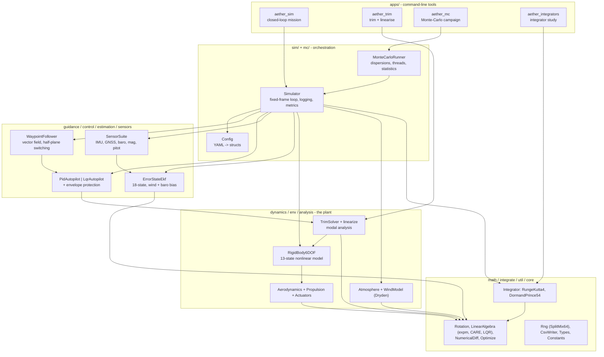

# Architecture

## Layering

The project is one static library (`libaether`) plus four thin command-line applications and
a Python analysis package. Every layer depends only on the layers below it; there are no
back-edges, and nothing in `dynamics/` knows that a controller or an estimator exists.



If your viewer does not render Mermaid, the same picture in plain text:

```
  aether_sim   aether_trim   aether_mc   aether_integrators        <- apps/
       |            |            |              |
       v            v            v              |
   Simulator   TrimSolver  MonteCarloRunner     |                  <- sim/, mc/, analysis/
       |            |            |              |
       +------------+-----+------+              |
                          |                     |
        +---------+-------+--------+---------+  |
        v         v       v        v         v  |
   WaypointF.  Autopilot  SensorSuite  EKF   RigidBody6DOF         <- guidance/, control/,
        |         |            |        |        |                    sensors/, estimation/,
        |         |            |        |        v                    dynamics/
        |         |            |        |   Aerodynamics
        |         |            |        |   Propulsion
        |         |            |        |   Actuators / Atmosphere / WindModel
        v         v            v        v        v
   ------------------------------------------------------
   Rotation | LinearAlgebra | Integrator | Rng | CsvWriter          <- math/, integrate/, util/
```

## The simulation loop

One iteration of `Simulator::run()` at the fixed outer step `dt`:

```
for each step k:                                       t = k*dt
  1. environment      rho = ISA(h);  W^n = steady(h) + R(q) g_body   (gusts held over the step)
  2. diagnostics      evaluate f(x, u_actuator, env) -> air data, specific force
  3. sensors          each channel emits a sample only when its own period has elapsed
  4. estimator        EKF predict on every IMU sample; update on GNSS / baro / mag / pitot
  5. guidance+control every control_every-th step: guidance -> commands -> autopilot -> u_cmd
  6. actuators        first-order lag + rate limit + saturation -> u_actuator
  7. metrics/logging  accumulate RMS statistics; write a decimated CSV row
  8. safety           ground contact, airspeed, bank, pitch, NaN -> abort with a reason
  9. integrate        x <- integrateTo(f, integrator, t, x, t+dt);  renormalise the quaternion
 10. environment step advance the Dryden filters by dt
```

Three properties follow from this structure and are worth stating explicitly:

* **The integrator choice cannot change the schedule.** Within one fixed frame the actuator
  state and the environment are held constant (zero-order hold), and the adaptive integrator
  sub-steps freely *inside* the frame. Swapping `rk4` for `dopri54` changes accuracy and cost,
  not which sensor fired when.
* **The sensors are genuinely asynchronous.** Each channel has its own phase accumulator, so
  200 Hz IMU, 50 Hz magnetometer/pitot, 20 Hz barometer and 5 Hz GNSS samples interleave the
  way they would on a real vehicle, and the filter sees them in that order.
* **Truth and estimate never mix.** The control laws see only a `VehicleFeedback` struct,
  which the simulator fills either from the truth state or from the navigation filter
  according to `control.feedback`. A control law physically cannot reach into a quantity a
  real autopilot would not have.

## Determinism

Every stochastic component draws from an explicitly seeded `util::Rng`. Seeds are derived
from a single master seed with SplitMix64:

```
seed(stream, index) = splitmix64( splitmix64(master ^ stream*C) + index )
```

Streams are allocated per subsystem (sensors, wind, filter initialisation) and per
Monte-Carlo trial index, so:

* re-running a scenario reproduces the trajectory bit-for-bit;
* changing the number of Monte-Carlo worker threads does not change any trial's result;
* trial `i` is reproducible on its own, without running trials `0…i−1`.

All three are asserted by tests (`[determinism]`).

## Directory map

| Path | Contents |
|---|---|
| `include/aether/core/` | `Types.hpp` (state layout, indices, units), `Constants.hpp` |
| `include/aether/math/` | quaternions/rotations, `expm`, Van Loan, CARE/LQR, numerical Jacobian, Levenberg-Marquardt |
| `include/aether/integrate/` | integrator interface, RK4, Dormand-Prince 5(4), driver |
| `include/aether/env/` | ISA atmosphere, wind/shear/Dryden turbulence |
| `include/aether/dynamics/` | airframe parameters, aerodynamics, propulsion, actuators, 6-DOF rigid body |
| `include/aether/analysis/` | trim solver, numerical linearisation, modal classification, export |
| `include/aether/control/` | PID primitive, PID autopilot, servo-LQR autopilot, envelope protection |
| `include/aether/guidance/` | waypoint follower |
| `include/aether/sensors/` | simulated IMU/GNSS/baro/magnetometer/pitot |
| `include/aether/estimation/` | 18-state error-state EKF |
| `include/aether/sim/` | configuration structs + YAML loading, simulator, metrics |
| `include/aether/mc/` | Monte-Carlo dispersions, runner, statistics |
| `include/aether/util/` | RNG, CSV writer |
| `src/` | implementations, mirroring `include/aether/` |
| `apps/` | the four command-line tools |
| `tests/` | Catch2 suite, one file per subsystem |
| `configs/aircraft/` | airframe parameter files |
| `configs/scenarios/` | scenario + Monte-Carlo campaign definitions |
| `python/aether_viz/` | loaders, plotting style, figure generators, animation |
| `python/scripts/` | `make_figures.py`, `animate.py` |
| `results/` | generated output; figures and summaries are committed, bulk logs are not |
| `docs/` | this documentation set |

## Extension points

| To add … | Touch |
|---|---|
| a different airframe | a new YAML under `configs/aircraft/`; no code changes |
| a new control law | implement `control::Autopilot`, add a `ControllerType` and a branch in the `Simulator` constructor |
| a new sensor | add a config struct + sample type in `sensors/`, emit it from `SensorSuite::sample`, add an `update…()` to the EKF |
| a new integrator | implement `integrate::Integrator`, register it in `makeIntegrator` |
| a new dispersion | add a field to `mc::DispersionConfig`, apply it in `MonteCarloRunner::buildTrial`, expose it in `loadMonteCarloConfig` |
| a new figure | add a function to `python/aether_viz/figures.py` and a call in `make_figures.py` |
